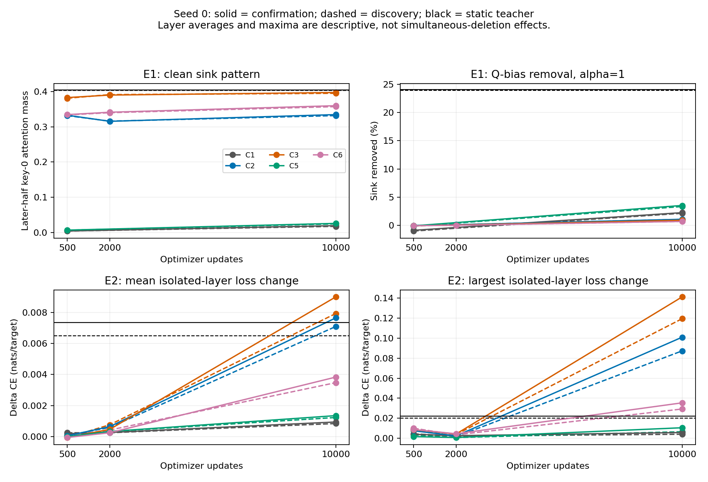

# KD-SINK E1 and E2 scientific results

Prepared on 2026-10-10 by Codex from the preserved AdritaPC campaign. All **28 E1 bundles and 32 E2 bundles** are independently complete and valid. This report analyzes existing scientific measurements; it introduces no new model inference. E3 is still running separately and contributes no results here.

The main finding is that **attention-sink pattern, the tested parameter routes, and causal sensitivity do not transfer together as one package**. C2/C3/C6 already have substantial key-0 attention at update 500, yet their Q-bias and top-three K-input interventions barely reduce it at that point. By update 10,000, isolated sink deletion is substantially more damaging at some student layers, especially C2/C3, while their Q-bias route remains much weaker than the teacher's. A high sink amplitude therefore does not establish the teacher's mechanism, and weaker Q-bias dependence does not establish weak causal dependence overall.

These are descriptive results from **one training seed**, fixed checkpoints and two document-disjoint panels. They support the stated distinction within these runs; they do not establish population-level reproducibility, practical equivalence, or a unique training-time mediator.

## Evidence, experimental identity and coverage

Scientific inference ran on AdritaPC's RTX 4080 SUPER, UUID `GPU-2a5c25d0-1f73-919b-fd8b-f6f0df709aaf`, with Python 3.12.3, PyTorch 2.10.0+cu128, Transformers 5.3.0, FP32 eager attention and TF32 disabled. NodiPC only reads and summarizes those original E1/E2 outputs. Source training precision and hardware recorded in S1 checkpoint identities are distinct from this follow-up inference runtime.

The teacher is frozen GPT-2-large: 36 layers, 20 native heads and residual width 1,280. Students are GPT-2-medium: 24 layers, 16 native heads and width 1,024, trained from configuration initialization rather than pretrained student weights. All follow-up student states are the exact D24-eligible seed-0 checkpoints.

| Experiment | States per panel | Discovery bundles | Confirmation bundles | Complete item records | Behavior rows per panel |
|---|---:|---:|---:|---:|---:|
| E1 route interventions | 13 students + teacher | 14 | 14 | 8,400 | 694 |
| E2 isolated sink deletion/accounting | 15 students + teacher | 16 | 16 | 9,600 | 396 |
| Total | Phase-specific grids | 30 | 30 | 18,000 | 1,090 |

Each bundle contains 300 fixed 128-token blocks and 38,100 valid next-token targets: 127 per block. Repeated states and interventions reuse those same blocks; 18,000 item records do not represent 18,000 unique texts. There are **600 unique blocks**, 300 per panel. Discovery spans 46 source documents and confirmation 32. Document IDs and normalized text hashes are disjoint between panels; blocks within a panel can share documents. Confirmation was selected from frozen LM2000 by the approved outcome-independent rule, but LM2000 had prior S1 endpoint measurements. It is a holdout for the new interventions, not wholly unseen historical data.

E1 includes C2/C3/C6 at updates 500, 2,000 and 10,000; C1/C5 only at 500 and 10,000. The absent E1 C1/C5 update-2,000 cells are **intentional protocol exclusions**, not missing or failed experiments. E2 includes all five conditions at all three updates. C0/C4 and other seeds are outside both grids.

| Condition | Source-training objective | Interpretive role |
|---|---|---|
| C1 | B = 0.5 CE + 0.5 logit KD | Behavioral distillation baseline |
| C2 | B + (1/9) cosine-soft attention JSD | Full attention supervision; primary temporal comparison |
| C3 | B + (1/9) calibrated head-mean probability MSE | High-sink alternative; TinyBERT-inspired, not exact TinyBERT |
| C5 | B + (1/9) conditional non-sink attention JSD | Sink-excluded supervision control |
| C6 | B + (1/9) sink-versus-rest JSD | Sink-allocation-only supervision |

C2 uses differentiable cosine-soft weights, without a separately parameterized alignment module; it is not the published Jin A2D module. C5 excludes key 0 before both alignment and JSD; C6 matches sink-versus-rest mass without supervising the non-sink shape. Architectural/head correspondence is not inferred from these objectives. The common S1 layer map is fixed, not learned.

## Quantities and denominators

**ΔCE** means edited-minus-clean cross entropy in nats per valid shifted target. Positive values mean worse target prediction; negative values mean improvement under that intervention. **Self-KL** is full-vocabulary KL(clean || edited), temperature 1, in nats per target. Prediction flips are a fraction of valid targets. Perplexity ratios are `exp(ΔCE)`; a CE change in nats is not itself a percentage change in perplexity.

E1 sink amplitude averages key-0 attention over native heads, selected layers and the later-half queries, positions 64–127 for these 128-token blocks. Sink-removed percentages are **means of each item's guarded relative removal**, not the relative change of the pooled means. Negative removal means the intervention increased sink mass. Behavior is token weighted; sink/dose summaries are item weighted.

E2 reports both all queries q=1–127 and later-half q=64–127. Its factor tables below use all q≥1 unless stated otherwise: 38,100 queries per layer/panel, versus 19,200 later-half queries. These factor populations differ from scored prediction positions q=0–126. q=0 predicts a target but its local deletion delta is zero; q=127 contributes to factor diagnostics but has no next-token target in the block. Both behavior and factor supports retain their approved definitions.

All layer numbers are zero based. Teacher native-36 and mapped-24 measurements are separate; mapped teacher layers are `[1,2,4,5,7,8,10,11,13,14,16,17,19,20,22,23,25,26,28,29,31,32,34,35]`. Native teacher and student layer means are architecture-specific descriptive summaries, not homologous circuit comparisons.

In tables, **D / C** means discovery / confirmation. Numbers are rounded for reading; the CSV files retain their original precision. Student rows labeled update 10,000 refer to optimizer updates, not microsteps; the teacher is a static reference.



*Solid lines: confirmation; dashed: discovery; black: static teacher. C1/C5 E1 lines connect two observed endpoints without imputing update 2,000. E2 averages summarize separate isolated interventions; maxima can involve different layers at different checkpoints.*

## Clean performance context

The following endpoints are clean outputs, before any E1/E2 intervention. Teacher KL is taken from the E1 `none` operation, not from an E2 edited output.

| State | Clean CE D / C | Clean PPL D / C | Clean KL(teacher || model) D / C | Clean accuracy % D / C |
| --- | --- | --- | --- | --- |
| teacher | 3.049856 / 3.159942 | 21.112 / 23.569 | 0.000000 / 0.000000 | 41.283 / 40.289 |
| C1/step10000 | 3.994480 / 4.167494 | 54.298 / 64.554 | 1.138995 / 1.178442 | 30.843 / 28.840 |
| C2/step10000 | 3.993255 / 4.155199 | 54.231 / 63.765 | 1.133003 / 1.170010 | 30.858 / 28.971 |
| C3/step10000 | 3.993202 / 4.165430 | 54.228 / 64.420 | 1.136565 / 1.173538 | 30.848 / 28.987 |
| C5/step10000 | 3.978249 / 4.148492 | 53.423 / 63.338 | 1.123761 / 1.163634 | 31.050 / 29.249 |
| C6/step10000 | 3.999072 / 4.173780 | 54.548 / 64.961 | 1.145302 / 1.185990 | 30.638 / 28.688 |

Students remain substantially worse language models than the teacher on these panels. At update 10,000, C5 has the lowest student clean CE on both panels, but the differences among student conditions are small relative to the teacher–student gap. This is descriptive ordering, not evidence of a statistically reliable objective advantage. Similar student clean performance also does not imply similar intervention responses.

## E1: route interventions and mechanistic inheritance

E1 scales the Q-bias slice or selected input rows of the K projection by `1−α`, with α = 0, .25, .5, .75, 1. Top-three coordinates are chosen independently for each model from `|p0 + MLP0(p0)|`, without LayerNorm. Five distinct seeded random coordinate sets exclude that top three and are retained separately. Across-model coordinates are not homologous. The same nominal α therefore need not deliver the same effective sink or activation dose.

### Clean sink pattern develops differently from route sensitivity

| State | Clean sink: discovery | Clean sink: confirmation |
| --- | --- | --- |
| teacher | 0.403594 | 0.404600 |
| C1/step500 | 0.003882 | 0.003883 |
| C1/step10000 | 0.017177 | 0.019194 |
| C2/step500 | 0.331843 | 0.333003 |
| C2/step2000 | 0.316192 | 0.315744 |
| C2/step10000 | 0.331967 | 0.334829 |
| C3/step500 | 0.381353 | 0.383225 |
| C3/step2000 | 0.391631 | 0.390355 |
| C3/step10000 | 0.395367 | 0.397594 |
| C5/step500 | 0.006206 | 0.006498 |
| C5/step10000 | 0.024235 | 0.025561 |
| C6/step500 | 0.333845 | 0.334833 |
| C6/step2000 | 0.340266 | 0.341559 |
| C6/step10000 | 0.357496 | 0.360163 |

C2 has strong sink mass by update 500, but the 500→2,000→10,000 trajectory is nonmonotonic on both panels. C3 approaches the native teacher's mean amplitude closely at update 10,000, while C1/C5 remain far smaller. C6 also develops substantial sink mass. None of those patterns identifies the parameter route responsible for it.

### Full-strength Q-bias and K-input probes

The table gives native-scope α=1 sink removal and ΔCE. Each `discovery / confirmation` pair retains the two populations separately.

| State | Q sink removed % D / C | Q ΔCE D / C | K-top3 sink removed % D / C | K-top3 ΔCE D / C |
| --- | --- | --- | --- | --- |
| teacher | 23.909 / 24.077 | 0.055995 / 0.058886 | 15.585 / 14.807 | 0.201095 / 0.193802 |
| C1/step500 | -0.974 / -0.846 | 0.000762 / 0.000759 | 0.353 / 0.271 | 0.000061 / 0.000035 |
| C1/step10000 | 2.164 / 2.279 | 0.000781 / 0.000887 | 15.827 / 16.534 | 0.004490 / 0.006546 |
| C2/step500 | -0.005 / -0.004 | 0.000523 / 0.000657 | 0.005 / -0.005 | 0.000666 / 0.000535 |
| C2/step2000 | 0.140 / 0.146 | 0.000210 / 0.000460 | 3.066 / 3.034 | 0.003697 / 0.003914 |
| C2/step10000 | 1.084 / 1.106 | 0.000903 / 0.001151 | 9.714 / 9.683 | 0.028006 / 0.032613 |
| C3/step500 | -0.031 / -0.026 | 0.000523 / 0.000580 | -0.006 / -0.019 | 0.000088 / 0.000074 |
| C3/step2000 | 0.082 / 0.090 | -0.000020 / 0.000069 | 1.708 / 1.640 | 0.001472 / 0.001232 |
| C3/step10000 | 0.928 / 0.928 | 0.000765 / 0.001034 | 12.166 / 11.838 | 0.034175 / 0.041772 |
| C5/step500 | -0.113 / -0.054 | 0.000288 / 0.000347 | 0.460 / 0.421 | 0.000008 / -0.000136 |
| C5/step10000 | 3.360 / 3.551 | 0.001174 / 0.001405 | 13.070 / 14.170 | 0.037685 / 0.038779 |
| C6/step500 | -0.034 / -0.030 | 0.000074 / 0.000093 | -0.019 / -0.028 | 0.000092 / 0.000043 |
| C6/step2000 | 0.046 / 0.048 | 0.000146 / 0.000369 | 1.612 / 1.555 | 0.001318 / 0.000171 |
| C6/step10000 | 0.721 / 0.723 | 0.000811 / 0.001589 | 6.412 / 6.298 | 0.013389 / 0.019359 |

The teacher loses roughly 24% of its native sink amplitude when Q bias is removed. Every update-10,000 student loses only about 0.72–3.55%. C3's almost teacher-sized sink amplitude accompanies only about 0.93% Q-bias removal on both panels. At update 500, C2/C3/C6 Q-bias removals are slightly negative, rather than silently rounded into evidence of mechanism absence.

Top-three K-input dependence increases with training. In C2, removal grows from approximately zero at update 500 to about 3% at 2,000 and 9.7% at 10,000, while the corresponding ΔCE grows. C3 and C6 show the same broad development. C5 has low absolute sink mass yet a sizable K-input behavioral response at 10,000; relative removal and behavioral damage are different quantities.

### Registered C2 temporal contrast and dose response

The primary temporal contrast is C2 update 500 versus 10,000, with update 2,000 as an intermediate descriptive observation. Confirmation curves are shown in full below; discovery curves and every random control are in the complete operation export.

| α | Teacher mapped Q: removed %; ΔCE | C2/10000 Q: removed %; ΔCE | Teacher mapped K: removed %; ΔCE | C2/10000 K: removed %; ΔCE |
| --- | --- | --- | --- | --- |
| 0 | 0.000; 0.000000 | 0.000; 0.000000 | 0.000; 0.000000 | 0.000; 0.000000 |
| 0.25 | 7.853; 0.001661 | 0.272; 0.000150 | 5.496; 0.005362 | 2.144; 0.001714 |
| 0.5 | 15.326; 0.008268 | 0.547; 0.000390 | 11.678; 0.022600 | 4.477; 0.006847 |
| 0.75 | 22.381; 0.018225 | 0.825; 0.000723 | 17.821; 0.058945 | 6.996; 0.016622 |
| 1 | 29.118; 0.031071 | 1.106; 0.001151 | 22.665; 0.115380 | 9.683; 0.032613 |

Within these curves, the student's response strengthens, especially for K-input intervention, but stays well below the teacher's sink removal at the same α. These are parameter interventions with potentially broader downstream effects; equal α does not provide equal effective dose or establish a sink-specific mediator.

| Panel | Operation | Paired ΔCE contrast median | Q25 | Q75 | P90 |
| --- | --- | --- | --- | --- | --- |
| discovery | E1 q_bias/native/1 | 0.000552 | -0.002466 | 0.003010 | 0.006180 |
| discovery | E1 k_top3/native/1 | 0.027362 | 0.006878 | 0.045096 | 0.067277 |
| confirmation | E1 q_bias/native/1 | 0.000679 | -0.002473 | 0.003203 | 0.005997 |
| confirmation | E1 k_top3/native/1 | 0.030286 | 0.010489 | 0.050896 | 0.067483 |
| discovery | E2 delete/layer13 | 0.080459 | 0.039223 | 0.132742 | 0.170484 |
| confirmation | E2 delete/layer13 | 0.094016 | 0.054502 | 0.144010 | 0.184915 |

Every paired distribution uses the same 300 items at both checkpoints, with signed update-10,000-minus-update-500 effects. Q-bias contrast IQRs straddle zero, whereas the K-input contrast has positive lower quartiles on both panels. That describes within-panel heterogeneity without a hypothesis test. The E2 layer-13 contrast is a retrospective layer-specific illustration; layer 13 was not declared the experiment's single primary layer.

### Effective-dose matching is mostly unavailable

The approved matched-dose analysis compares mapped teacher-24 with student native-24, targeting 10%, 25% and 50% sink removal for Q bias, top-three K input and all five random K sets. Each panel has **273 comparisons**: 13 students × 7 routes × 3 targets. Only **3/273** have a unique observed overlap; **270/273** are dose-unmatched on each panel. The three overlaps are all top-three K input at 10% removal, for C1/C3/C5 update 10,000. There are no supported Q-bias matches and no supported 25% or 50% matches. Missing overlap is an unavailable comparison, not a null effect.

| Panel | State at 10% K-top3 removal | Teacher α | Student α | Teacher interpolated ΔCE | Student interpolated ΔCE | Student − teacher |
| --- | --- | --- | --- | --- | --- | --- |
| discovery | C1/step10000 | 0.4151 | 0.6255 | 0.014386 | 0.001508 | -0.012878 |
| discovery | C3/step10000 | 0.4151 | 0.8504 | 0.014386 | 0.023381 | 0.008995 |
| discovery | C5/step10000 | 0.4151 | 0.6561 | 0.014386 | 0.012826 | -0.001561 |
| confirmation | C1/step10000 | 0.4321 | 0.5951 | 0.017921 | 0.002437 | -0.015484 |
| confirmation | C3/step10000 | 0.4321 | 0.8696 | 0.017921 | 0.030807 | 0.012886 |
| confirmation | C5/step10000 | 0.4321 | 0.6072 | 0.017921 | 0.012410 | -0.005511 |

Values are linear descriptive interpolation between adjacent observed α points; they are not additional measured forward passes. Within the small supported set, C3 has more loss damage than the mapped teacher at matched 10% relative sink removal on both panels, C1 less, and C5 somewhat less. Equal fractional removal still does not equate absolute sink mass, residual bases or activation dose, particularly for low-sink C1/C5. No practical equivalence margin was approved.

### Controls and broad position diagnostics

| State | Five random-K ΔCE range (C) | Position0→1: removed %; ΔCE (C) | EPE: removed %; ΔCE (C) |
| --- | --- | --- | --- |
| teacher | -0.000174 to 0.002402 | 98.396; 1.481533 | 98.213; 0.120089 |
| C1/step10000 | 0.000075 to 0.000738 | 70.242; 0.041153 | -0.037; 0.000082 |
| C2/step10000 | 0.000031 to 0.000429 | 91.791; 0.377034 | -0.004; 0.000032 |
| C3/step10000 | -0.000093 to 0.000171 | 95.152; 0.346575 | -0.004; 0.000001 |
| C5/step10000 | 0.000058 to 0.000318 | 75.196; 0.062248 | -0.033; 0.000002 |
| C6/step10000 | -0.000126 to 0.000851 | 93.663; 0.232877 | 0.006; 0.000047 |

For every α=0 operation, `none`, and exact Q-bias reapplication, the pooled absolute ΔCE is **exactly 0**. These verify clean/no-op behavior. Full random-coordinate results are preserved rather than selecting a favorable random set.

Position-0→1 transport is broad: it removes much of the sink pattern and causes appreciable behavioral damage in both teacher and students. It cannot isolate a Q/K-specific sink mechanism. The separate layer-0 EPE activation transport removes about 98% of teacher sink amplitude, with ΔCE around 0.12, but changes student sink amplitude only minimally—even in C2/C3/C6 with strong clean sinks. This is a diagnostic transport of MLP outputs; it does not reconstruct an EPE under LayerNorm. Near-zero student effects do not prove that all positional computation or all possible alternative interventions are absent.

## E2: exact output accounting and isolated causal dependence

E2 removes key-0 attention in **one native layer at a time**, reconstructing conditional non-sink probabilities from the same live scores. For head h and query i≥1, the output change is

`δo(i,h) = a(i,0,h) × [conditional non-sink value(i,h) − value(0,h)]`.

Native heads are concatenated and projected through the GPT-2 output matrix; its bias cancels. q=0 and padding have zero edit. Live attention-output reconstruction, direct deletion, projected deltas and clean-delta injection are checked against the actual edited logits. Consequently, E2 measures downstream response to a validated isolated deletion, while its value/projection/cancellation factors explain the immediate local output change. It does not add separate layer effects into a simultaneous all-layer causal decomposition.

### All checkpoint trajectories and layer heterogeneity

The mean below is the unweighted mean ΔCE across all separate native-layer deletions. It preserves signed effects and all layers. It is a descriptive average of interventions, not the effect of deleting all layers together. `Peak` is the largest observed layer-specific ΔCE and is explicitly an outcome-selected summary; it is not a prespecified primary endpoint, a homology claim or a multiple-testing-adjusted result. Every layer is retained in the CSV.

| State | Mean isolated-layer ΔCE D / C | Peak ΔCE D / C | Peak layer D / C |
| --- | --- | --- | --- |
| teacher | 0.006506 / 0.007341 | 0.020130 / 0.022215 | 17 / 17 |
| C1/step500 | 0.000245 / 0.000192 | 0.004374 / 0.003886 | 0 / 0 |
| C1/step2000 | 0.000245 / 0.000263 | 0.002147 / 0.002537 | 0 / 0 |
| C1/step10000 | 0.000839 / 0.000940 | 0.003958 / 0.005671 | 16 / 14 |
| C2/step500 | 0.000076 / 0.000048 | 0.009007 / 0.007428 | 0 / 0 |
| C2/step2000 | 0.000588 / 0.000641 | 0.001570 / 0.002354 | 11 / 11 |
| C2/step10000 | 0.007097 / 0.007653 | 0.087343 / 0.101001 | 13 / 13 |
| C3/step500 | -0.000061 / -0.000052 | 0.009452 / 0.008555 | 0 / 0 |
| C3/step2000 | 0.000761 / 0.000464 | 0.003734 / 0.004190 | 0 / 0 |
| C3/step10000 | 0.007934 / 0.009007 | 0.119519 / 0.141319 | 12 / 12 |
| C5/step500 | 0.000132 / -0.000001 | 0.003264 / 0.001605 | 0 / 0 |
| C5/step2000 | 0.000324 / 0.000329 | 0.000696 / 0.000735 | 0 / 9 |
| C5/step10000 | 0.001229 / 0.001351 | 0.006509 / 0.010471 | 13 / 13 |
| C6/step500 | 0.000053 / -0.000059 | 0.009993 / 0.008725 | 0 / 0 |
| C6/step2000 | 0.000421 / 0.000246 | 0.003356 / 0.004432 | 0 / 0 |
| C6/step10000 | 0.003477 / 0.003835 | 0.029218 / 0.035385 | 15 / 15 |

Early high-sink C2/C3/C6 checkpoints have small, sometimes negative, native-layer-average signed ΔCE despite a damaging layer-0 deletion. Opposite effects at other layers are retained. By 10,000 updates, C2/C3 mean isolated-layer damage is larger than the teacher's native-layer mean on both panels; C6 is below it, while C1/C5 are much lower. Architecture and baseline-performance differences limit interpretation of those averages.

At the most sensitive layers, final C2/C3/C6 exceed the teacher's largest isolated ΔCE. Confirmation maxima are **0.101001, 0.141319 and 0.035385** nats/target, respectively, versus **0.022215** for the teacher: approximately 4.55×, 6.36× and 1.59×. Discovery shows the same ordering. These ratios compare each model's observed maximum across its own native layers; they establish neither head/layer homology nor an inferential claim. C1's most sensitive layer changes between panels, warning against equating a retrospective maximum with a stable circuit identity.

### Endpoint magnitude, distribution and loss geometry

| Panel | State | Peak layer | Peak self-KL | ΔCE median | Q25 | Q75 | P90 |
| --- | --- | --- | --- | --- | --- | --- | --- |
| discovery | teacher | 17 | 0.017366 | 0.019548 | 0.006621 | 0.032103 | 0.044143 |
| discovery | C1/step10000 | 16 | 0.002537 | 0.002249 | -0.001136 | 0.007178 | 0.012518 |
| discovery | C2/step10000 | 13 | 0.086965 | 0.081824 | 0.040881 | 0.132349 | 0.171110 |
| discovery | C3/step10000 | 12 | 0.115644 | 0.109751 | 0.056788 | 0.163184 | 0.230792 |
| discovery | C5/step10000 | 13 | 0.005454 | 0.004507 | -0.000679 | 0.011547 | 0.020382 |
| discovery | C6/step10000 | 15 | 0.024139 | 0.028962 | 0.010840 | 0.046240 | 0.064100 |
| confirmation | teacher | 17 | 0.018466 | 0.022096 | 0.007734 | 0.035178 | 0.046586 |
| confirmation | C1/step10000 | 14 | 0.004851 | 0.003318 | -0.001153 | 0.009529 | 0.020329 |
| confirmation | C2/step10000 | 13 | 0.100470 | 0.094319 | 0.054744 | 0.143503 | 0.187426 |
| confirmation | C3/step10000 | 12 | 0.134443 | 0.128292 | 0.080533 | 0.202483 | 0.265021 |
| confirmation | C5/step10000 | 13 | 0.009494 | 0.006078 | -0.000822 | 0.016508 | 0.032334 |
| confirmation | C6/step10000 | 15 | 0.029221 | 0.033188 | 0.013891 | 0.051908 | 0.076783 |

All rows contain 300 measured items; quartiles and p90 describe the item distribution rather than uncertainty in a population estimate. C2/C3's final peak-layer damage has positive lower quartiles on both panels. C1/C5 distributions include improvements under deletion, as their negative lower quartiles show. The broad item distributions matter: a small mean cannot by itself establish absence of dependence.

| State, confirmation peak layer | Positive ΔNLL / target | Negative ΔNLL / target | Signed double ΔNLL / target | Prediction flips % |
| --- | --- | --- | --- | --- |
| teacher / 17 | 0.077315 | -0.055100 | 0.022215 | 8.142 |
| C1/step10000 / 14 | 0.029027 | -0.023356 | 0.005671 | 3.441 |
| C2/step10000 / 13 | 0.216458 | -0.115457 | 0.101001 | 19.192 |
| C3/step10000 / 12 | 0.268013 | -0.126694 | 0.141319 | 21.113 |
| C5/step10000 / 13 | 0.043462 | -0.032991 | 0.010471 | 4.766 |
| C6/step10000 / 15 | 0.105745 | -0.070360 | 0.035385 | 10.916 |

Positive and negative target-loss terms are retained separately and summed with their signs. The near cancellation for some interventions explains why average signed ΔCE alone can obscure substantial output changes. Self-KL, flips, absolute target-logprob changes and full-vocabulary centered logit geometry provide complementary accounts; they are not interchangeable units or a composite inheritance score.

### Proximate factors: sink mass is only one multiplier

| State at 10,000 | All-q sink mass D / C | Relative projected norm D / C | Cancellation ratio D / C |
| --- | --- | --- | --- |
| teacher | 0.45566 / 0.45714 | 1.09342 / 1.12289 | 0.23930 / 0.23900 |
| C1/step10000 | 0.05496 / 0.05766 | 0.11827 / 0.12603 | 0.66567 / 0.66482 |
| C2/step10000 | 0.37451 / 0.37709 | 0.67706 / 0.68965 | 0.48620 / 0.48657 |
| C3/step10000 | 0.43905 / 0.44121 | 0.72137 / 0.73710 | 0.45729 / 0.45678 |
| C5/step10000 | 0.06814 / 0.06983 | 0.15231 / 0.16140 | 0.62043 / 0.62209 |
| C6/step10000 | 0.40011 / 0.40259 | 0.58960 / 0.59992 | 0.46622 / 0.46529 |

Cancellation is `||sum projected head contributions|| / sum ||projected head contributions||`, pooled over defined queries. Smaller values mean stronger cancellation. The relative projected norm is a query mean of `||δattention_output|| / ||clean_attention_output||`, with the approved floor. It can exceed 1; it is not a fraction of loss, a mediation fraction, or the ratio of pooled norms. Head-value norms are architecture-local units.

The teacher has more average sink mass and larger relative local output changes than the students in this summary, but also stronger cancellation of projected head contributions: about 0.239 versus approximately 0.457–0.665 in final students. Thus sink mass, value contrast, projection and cancellation all affect the local change, and downstream networks convert that change into loss differently. C2/C3 can have greater peak behavioral damage despite smaller mean relative output change. These layer-averaged factors are explanatory diagnostics, not evidence that cancellation alone causes the between-condition differences. Both approved query supports and head-mean value contrasts are retained in `e2_factors.csv`.

## Joint interpretation and limits

1. **Pattern transfers readily under some attention objectives.** C2/C3/C6 have substantial early sink patterns; C1/C5 stay much smaller. C3 becomes especially close to the teacher's mean amplitude. Pattern resemblance does not imply matched head or layer circuits.
2. **The tested parameter routes do not converge as a package.** Q-bias dependence remains far below the teacher's in every student, while K-input dependence strengthens. EPE transport sharply distinguishes teacher from high-sink students. Most teacher–student route comparisons lack approved matched-dose overlap, so strong absence/equivalence conclusions are unavailable.
3. **Causal sensitivity can increase rather than disappear.** E2's final C2/C3 peaks and native-layer averages show increasing isolated-deletion damage; C6 also develops an above-teacher peak. This rules out treating “weak Q-bias response” as synonymous with “sinks have little causal impact.” It does not prove that a unique teacher mechanism was inherited.
4. **Controls reveal different separations.** C5 retains low sink amplitude yet a strong K-input behavioral response, whereas C6's substantial sink mass does not make its E2 average as large as C2/C3. Attention-pattern and behavioral-function metrics must remain separate.
5. **Confirmation supports the broad descriptive account, with qualifications.** The main objective ordering, route disparities and final sensitive layers agree across panels for C2/C3/C5/C6 and the teacher. Effect sizes and some layer rankings change; C1's final maximum is layer 16 in discovery and 14 in confirmation. Two disjoint text panels from one training seed are not independent training replications.

C2's clean pattern is nonmonotonic, while its Q/K sink removal grows. A scalar component may approach one teacher reference while another moves away; no single global “convergence” label is justified. The registered per-component trajectories and all raw controls are exported. No p-values, confidence intervals, bootstrap, equivalence decisions, onset threshold or mediation percentage is introduced. Ten thousand updates is the observed horizon, not proof of training convergence. E3 interventions/rescues are needed for their own questions and must be analyzed only after their separate valid completion.

## Integrity, reproducibility and source locations

The immutable transferred ZIP is `C:\Users\user3\kd-sink files\mechanistic_e1_e3_transfer_20261010_104335_BDT.zip`, 19,946,263,971 bytes, SHA-256 `4000dc81102b809020beeda491b20cb3b7dc309c0bfb787290e3fc50a25f8378`. ZIP64 validation, every-member CRC and original member SHA checks passed during migration. Read-only original results are under `C:\KD-E3-Nodi-20261010\imported_adrita\campaign`; reconstruction and both independent/original-runner receipts are under `C:\KD-E3-Nodi-20261010\reconstruction01`.

This report selects attempts using the SHA-sealed `ALL_92_JOBS.json`, rather than guessing `attempt_001`. In particular, E2 confirmation C2/update-500 uses valid `attempt_002`; old interrupted attempts remain preserved. All 60 selected E1/E2 bundles have 300 complete items and both PASS receipts bound to their exact manifest. Consumed summaries and descriptive exports were rehashed; each archived report's joined summary must equal the selected source summary. Original full member verification and semantic audits are reused, not represented as a newly run full suite. Focused rechecks independently reconstruct selected reported cells from original item records.

The focused CPU crosscheck rehashed **1,800 raw item files** from six bundles, independently recomputed **12 published operation cells** and **three paired C2 confirmation distributions**, and found a maximum absolute numerical discrepancy of `6.647243519508628e-16`. All **10 focused report tests** passed. This verifies the disclosed subset and report integrity checks, not a repeated audit of every numerical cell. The small [verification receipt](mechanistic_e1_e2_verification_20261010.json) records commands, hashes and scope. The original failed test fixture is retained externally; its missing synthetic job-ID field was corrected, with no change to source evidence or scientific gates.

| Integrity quantity | Result |
|---|---:|
| Independently valid E1 / E2 bundles | 28 / 32 |
| Unavailable measured item-operations in those bundles | 0 |
| Largest recorded E2 componentwise-parity absolute error | 0.0001220703125 |
| Largest independent E1/E2 double-geometry identity error | 4.447830992404533e-15 |
| Largest pooled absolute E1 no-op ΔCE | 0 |

Parity gates are the original componentwise absolute `1e-3` plus relative `1e-4 × |reference|` checks. Double loss-geometry tolerance is absolute `1e-10`, zero relative slack. Recorded scalar maxima establish the disclosed audit scope; tensor components not serialized cannot be reconstructed independently from these summaries. Numerical closure proves the tested engineering identities, not scientific equivalence between models.

| Frozen identity | SHA-256 / commit |
|---|---|
| Original scientific executor | `f96c73061f9ef288c72f309e09c4c1f17a8a6701` |
| Approved E1 envelope digest | `aa280a9a1244c7e00bff5e88fe342548ac587553788c24dd072eeab8542528f6` |
| Approved E2 envelope digest | `1ba9dff94bdd6735cb1cd1c871a655094a91bd1b96c746e9f26f14f942c3d586` |
| Original Adrita runtime identity | `df8b0b3258a9e9bd236e8a9d7281e95a68d3e5555733e76404fda338db5ada0b` |
| Original combined prepared-panel file | `509a90c6039cd90d7d4f6986ac7fe3b75468609073b4808baa8b5bae5294c7f7` |

Each checkpoint's exact original weight hash, bundle manifest hash, summary hash and audit hashes are in [analysis.json](mechanistic_e1_e2_results_20261010/analysis.json). Historical source paths are retained for provenance; they are not new NodiPC execution claims. Original results, protocols and active E3 execution pins were not edited.

The companion files preserve unrounded values and full coverage:

- [operations.csv](mechanistic_e1_e2_results_20261010/operations.csv): all 2,180 E1/E2 operation rows, behavior, signed geometry, E1 sink/activation doses, every α, scope and random control.
- [state_endpoints.csv](mechanistic_e1_e2_results_20261010/state_endpoints.csv): all 32 state/panel endpoints, explicit peak layers and both factor supports; protocol-excluded E1 values are blank.
- [e2_factors.csv](mechanistic_e1_e2_results_20261010/e2_factors.csv): all 1,584 native-layer/support rows, value contrasts, norms, cancellation and defined support counts.
- [e1_dose_matches.csv](mechanistic_e1_e2_results_20261010/e1_dose_matches.csv): every matched and unmatched comparison, including interpolation brackets.
- [FILES_SHA256.json](mechanistic_e1_e2_results_20261010/FILES_SHA256.json): companion-file hashes; [SVG figure](mechanistic_e1_e2_results_20261010/trajectories.svg) for export.

Archived full item-distribution and paired-temporal exports remain outside Git at `imported_adrita\campaign\reports\E1_discovery`, `E1_confirmation`, `E2_discovery`, `E2_confirmation`. The original sealed per-item records retain target-level geometry and native-head details; the new compact factor CSV uses explicit head means and does not claim to reproduce every head-level diagnostic. Read [E1](../design/e6a_v2/studies/MECHANISTIC_E1_PROTOCOL_v1.md), [E2](../design/e6a_v2/studies/MECHANISTIC_E2_PROTOCOL_v1.md), [common definitions](../design/e6a_v2/studies/MECHANISTIC_PROTOCOL_COMMON_v1.md) and the [approved protocols](../protocols/mechanistic_e1_e3_approved_20261009/) alongside the later approval record; the earlier draft-status wording in the specification files is historical.

Rebuild the numerical companions and figure without using the GPU:

```powershell
.venv\Scripts\python.exe scripts/summarize_mechanistic_e1_e2.py `
  --root C:\KD-E3-Nodi-20261010 `
  --output reports\mechanistic_e1_e2_results_20261010
```

The Markdown interpretation is editorial; the script regenerates verified numerical exports. Raw data, weights, bulk logs and historical attempts remain external to Git.
