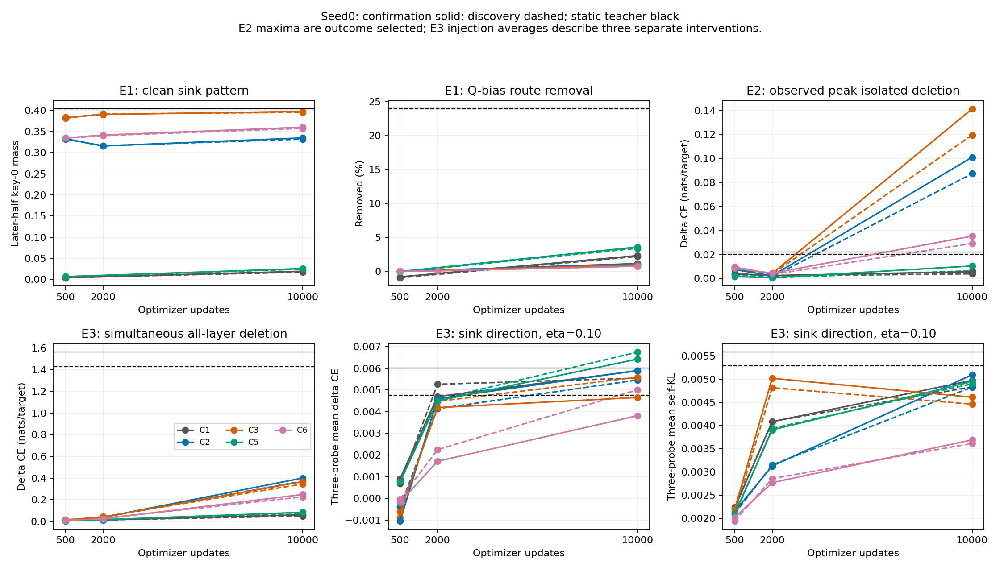

# KD-SINK combined E1–E3 scientific report

Prepared on 2026-10-11 (Asia/Dhaka) by Codex from **92 independently valid bundles: E1 28, E2 32, E3 32**. All phases are complete. This report connects the [detailed E1/E2 report](MECHANISTIC_E1_E2_RESULTS_20261010.md) with the [new E3 report](MECHANISTIC_E3_RESULTS_20261011.md), using exact matched checkpoint weights and panel items. It introduces no new scientific inference.

**Sink pattern, the tested parameter routes and causal response do not transfer together as one uniform package.** C2/C3/C6 acquire large sink patterns early, while Q-bias/EPE route responses remain much weaker than the teacher's. Their isolated and simultaneous deletion sensitivity grows later. E3 adds that normalized downstream response depends on direction and depth, and that simultaneous deletion is strongly nonlinear. The teacher has greater simultaneous all-layer damage than any final student even though final C2/C3 have larger observed isolated-layer peaks. A single statement such as “sinks transfer without function” or “students inherit the teacher mechanism” would omit important components of these measurements.

## Shared design and evidence

The teacher is frozen GPT-2-large (36 layers/20 heads); students are independently trained-from-configuration GPT-2-medium (24 layers/16 heads), exact S1 seed-0 checkpoints. C1 is behavioral CE/logit-KD, C2 full cosine-soft attention JSD, C3 calibrated head-mean probability MSE, C5 conditional non-sink attention JSD and C6 sink-versus-rest JSD. The adaptations and fixed layer map are retained; no head/circuit homology is inferred. C0/C4 and additional seeds are outside this follow-up grid.

| Phase | Scientific question | Bundles | Item records | Grid |
|---|---|---:|---:|---|
| E1 | Q/K parameter routes, sink dose and broad positional diagnostics | 28 | 8,400 | 13 students + teacher, two panels |
| E2 | Validated isolated sink deletion and local output factors | 32 | 9,600 | 15 students + teacher, two panels |
| E3 | Equal-norm directional response, rescue and simultaneous/ordered deletion | 32 | 9,600 | 15 students + teacher, two panels |
| Total | Phase-specific measurements | 92 | 27,600 | 600 unique blocks reused |

Each bundle has 300 blocks, 38,400 input tokens and **38,100 valid shifted prediction targets**. All behavior changes are token weighted in nats/target; sink removals are item-weighted guarded fractions; factors use their declared query supports. Summaries do not turn repeated states/interventions into extra unique observations. The 300-item panels have disjoint source-document IDs and normalized text hashes, but blocks within a panel can share documents. Confirmation is intervention-held-out rather than wholly unseen historical data because its frozen LM2000 region had S1 endpoint measurements.

E1 intentionally excludes C1/C5 at update 2,000. E2/E3 include them, and the joint CSV explicitly leaves those E1 cells blank. The historical E1/E2 report's “E3 running” statement describes its 2026-10-10 preparation snapshot; it is preserved as a historical report, and this document gives the completed status.

All E1/E2 measurements and 17 E3 bundles are Adrita outputs. The remaining 15 E3 confirmation student bundles ran on Nodi under the researcher-authorized successor. Each bundle retains its own sealed runtime/protocol; no original E1/E2 execution is relabeled as Nodi. Exact fixed-item migration comparisons, all 32 matched E2 dependencies and an empty scientific-field diff support the explicit mixed-runtime join. The [migration record](../E3_NODIPC_MIGRATION_FEASIBILITY.md) describes qualification, path relocations and historical audit corrections. Two physical GPUs are not replicated training seeds.

## Matched endpoint comparison

D / C denotes discovery / confirmation. E2 `peak` is the largest observed isolated native-layer ΔCE and can select a different layer per model/panel. E3 injection mean describes separate probes at predefined coarse thirds. They are different estimands, with different layer coverage.

| Final state | E1 clean sink D / C | E1 Q removal % D / C | E2 peak isolated ΔCE D / C | E3 all-layer ΔCE D / C | E3 sink η=.10 mean ΔCE D / C |
| --- | --- | --- | --- | --- | --- |
| teacher | 0.403594 / 0.404600 | 23.909323 / 24.077327 | 0.020130 / 0.022215 | 1.427109 / 1.560854 | 0.004771 / 0.006028 |
| C1/step10000 | 0.017177 / 0.019194 | 2.164177 / 2.279145 | 0.003958 / 0.005671 | 0.051177 / 0.062280 | 0.005552 / 0.005892 |
| C2/step10000 | 0.331967 / 0.334829 | 1.083878 / 1.105905 | 0.087343 / 0.101001 | 0.373226 / 0.401207 | 0.005466 / 0.005903 |
| C3/step10000 | 0.395367 / 0.397594 | 0.928025 / 0.927786 | 0.119519 / 0.141319 | 0.346259 / 0.368216 | 0.005596 / 0.004657 |
| C5/step10000 | 0.024235 / 0.025561 | 3.359740 / 3.551156 | 0.006509 / 0.010471 | 0.070046 / 0.085264 | 0.006752 / 0.006430 |
| C6/step10000 | 0.357496 / 0.360163 | 0.720639 / 0.722595 | 0.029218 / 0.035385 | 0.227312 / 0.249293 | 0.005008 / 0.003817 |

The teacher's Q-bias removal is roughly 24%, versus about 0.72–3.55% in final students. C3 has almost teacher-sized mean sink mass but only about 0.93% Q-bias removal. Nevertheless, final C3/C2 isolated-deletion peaks exceed the teacher's on both panels. E3 all-layer deletion gives the opposite teacher/student magnitude ordering, with the teacher substantially larger. These statements can hold together because isolated maxima and simultaneous interventions answer different questions.

*Full registered checkpoint trajectories; confirmation solid, discovery dashed, static teacher black. E1 lines for C1/C5 connect the observed endpoints without imputing update 2,000.*

## Pattern and route evidence from E1

C2/C3/C6 have substantial key-0 attention by update 500. C3 moves near the teacher's native mean amplitude at update 10,000; C2's pattern is nonmonotonic while its tested Q/K dependence grows. C1/C5 retain small sinks. Q-bias removal and layer-0 EPE transport distinguish the teacher from high-sink students, while top-three K-input dependence grows through training. Coordinates are chosen separately per model and are not homologous.

Equal parameter α is not equal sink or activation dose. In each panel, only **3/273** approved E1 dose comparisons have unique observed overlap: top-three K input at 10% relative sink removal for final C1/C3/C5. The other 270 are dose-unmatched; no supported Q-bias or 25%/50% matches exist. Missing dose overlap cannot establish a null or equivalence. Broad position-0→1 interventions strongly affect both pattern and behavior, but do not isolate one Q/K mechanism.

The detailed E1/E2 report preserves every α, teacher native/mapped scope, all five random-coordinate controls and signed effects. C3's supported K-top3 10% comparisons have more ΔCE damage than the mapped teacher on both panels; C1/C5 have less. Relative removal still does not equate absolute sink mass, residual bases or broader activation dose. The evidence supports component-specific route differences, not a universal inheritance/absence verdict.

## Natural deletion, local factors and downstream response

E2 measures one native layer at a time and verifies its immediate attention-output delta against actual deletion and clean-delta injection. Sink mass multiplies a conditional non-sink-versus-sink value contrast; projection and cross-head cancellation also matter. The teacher's mean relative local output change is larger and its projected heads cancel more strongly than final students. These architecture-local diagnostic averages do not by themselves predict which downstream intervention produces most loss damage.

E3's normalized sink direction fixes a fraction of each clean entering residual norm. It separates response to that local direction from the naturally delivered deletion magnitude, while preserving direction-specific controls. It does not hold the same absolute vector or activation norm constant across models/checkpoints. A low-sink checkpoint can still respond to a normalized direction; a high-sink checkpoint can show comparable or greater response to a non-sink control. Random/orthogonal/non-sink responses therefore remain part of the result rather than disposable nulls.

The predefined E3 coarse probes are teacher [5,17,29] and student [3,11,19]. They omit the final E2 student peaks at C2 layer 13, C3 layer 12 and C6 layer 15. E3's coarse injection measurements cannot explain or refute sensitivity at those unprobed E2 peaks. The fine-layer extension was not run. Across matched coarse layers, original E2 and E3 isolated-deletion behavior/geometry are exactly equal; no phase drift is concealed.

Common direction support excludes 7,803 query-layer observations at η=.10 across early C1 and update-2,000 C6; every other state/panel has full eligible support. Every direction uses the same support within a given item, while cross-checkpoint supports can differ. The E3 support tables retain those counts; excluded queries are not interpreted as zero sensitivity.

## Simultaneous deletion is not the sum of isolated effects

The next table compares all-layer E3 ΔCE with the numerical sum of all separate E2 isolated-layer ΔCE values. The difference is an observed nonadditivity account, not a “synergy percentage,” mediation fraction or independent interaction estimate.

| Final state | Sum of isolated E2 ΔCE D / C | E3 all-layer ΔCE D / C | All-layer minus isolated sum D / C |
| --- | --- | --- | --- |
| teacher | 0.234204 / 0.264266 | 1.427109 / 1.560854 | 1.192904 / 1.296588 |
| C1/step10000 | 0.020148 / 0.022568 | 0.051177 / 0.062280 | 0.031030 / 0.039712 |
| C2/step10000 | 0.170327 / 0.183681 | 0.373226 / 0.401207 | 0.202900 / 0.217526 |
| C3/step10000 | 0.190408 / 0.216158 | 0.346259 / 0.368216 | 0.155851 / 0.152058 |
| C5/step10000 | 0.029504 / 0.032415 | 0.070046 / 0.085264 | 0.040543 / 0.052849 |
| C6/step10000 | 0.083436 / 0.092044 | 0.227312 / 0.249293 | 0.143876 / 0.157249 |

Every final state's simultaneous effect exceeds its sum of isolated effects on both panels. The teacher's confirmation isolated sum is much smaller than its 1.560854 simultaneous ΔCE. Thus averaging or summing isolated effects would understate the measured all-layer response. Complete forward/reverse telescopes reach the same final endpoint, but assign different increments to layers depending on prior edits; those increments are conditional/order-dependent.

Clean-output isolated rescue returns to clean under original logit gates. In an all-layer-deleted network, restoring a single coarse clean donor leaves substantial damage. C2 confirmation layer-19 restoration leaves 0.358520 ΔCE from an all-layer 0.401207; teacher layer-17 restoration leaves 1.203843 from 1.560854. Those conditional rescue differences are not unique layer contributions. See the E3 report for every endpoint rescue and both full layer-order accounts.

## Full checkpoint context

| State | E1 clean sink D / C | E1 Q removal % D / C | E2 peak isolated ΔCE D / C | E3 all-layer ΔCE D / C |
| --- | --- | --- | --- | --- |
| teacher | 0.403594 / 0.404600 | 23.909323 / 24.077327 | 0.020130 / 0.022215 | 1.427109 / 1.560854 |
| C1/step500 | 0.003882 / 0.003883 | -0.973924 / -0.845935 | 0.004374 / 0.003886 | 0.007594 / 0.006532 |
| C1/step2000 | excluded / excluded | excluded / excluded | 0.002147 / 0.002537 | 0.014021 / 0.014295 |
| C1/step10000 | 0.017177 / 0.019194 | 2.164177 / 2.279145 | 0.003958 / 0.005671 | 0.051177 / 0.062280 |
| C2/step500 | 0.331843 / 0.333003 | -0.004583 / -0.004147 | 0.009007 / 0.007428 | 0.012265 / 0.014148 |
| C2/step2000 | 0.316192 / 0.315744 | 0.139848 / 0.146222 | 0.001570 / 0.002354 | 0.038174 / 0.038781 |
| C2/step10000 | 0.331967 / 0.334829 | 1.083878 / 1.105905 | 0.087343 / 0.101001 | 0.373226 / 0.401207 |
| C3/step500 | 0.381353 / 0.383225 | -0.030935 / -0.025997 | 0.009452 / 0.008555 | 0.012057 / 0.015926 |
| C3/step2000 | 0.391631 / 0.390355 | 0.081916 / 0.090051 | 0.003734 / 0.004190 | 0.044084 / 0.040333 |
| C3/step10000 | 0.395367 / 0.397594 | 0.928025 / 0.927786 | 0.119519 / 0.141319 | 0.346259 / 0.368216 |
| C5/step500 | 0.006206 / 0.006498 | -0.113105 / -0.053919 | 0.003264 / 0.001605 | 0.008026 / 0.005352 |
| C5/step2000 | excluded / excluded | excluded / excluded | 0.000696 / 0.000735 | 0.016026 / 0.017210 |
| C5/step10000 | 0.024235 / 0.025561 | 3.359740 / 3.551156 | 0.006509 / 0.010471 | 0.070046 / 0.085264 |
| C6/step500 | 0.333845 / 0.334833 | -0.034249 / -0.030496 | 0.009993 / 0.008725 | 0.011686 / 0.010674 |
| C6/step2000 | 0.340266 / 0.341559 | 0.046233 / 0.048390 | 0.003356 / 0.004432 | 0.029482 / 0.024998 |
| C6/step10000 | 0.357496 / 0.360163 | 0.720639 / 0.722595 | 0.029218 / 0.035385 | 0.227312 / 0.249293 |

The primary temporal contrast is C2 500→10,000, with 2,000 descriptive. E3 all-layer damage increases at all observed student intervals on both panels; the E1 pattern/Q/K trajectories and E3 equal-norm responses have their own shapes. No global convergence classification is imposed on this multi-component evidence. C1/C5 E1 update-2,000 entries are protocol-excluded, not failed measurements.

Students also remain worse language models than the teacher: confirmation endpoint clean CE is 3.159942 for the teacher and roughly 4.148–4.174 for these students. Absolute ΔCE, relative PPL changes, full-vocabulary self-KL, flips and signed target-loss geometry are distinct. Similar clean student performance does not equate intervention responses, and architecture/clean-performance differences constrain teacher/student causal comparisons.

## Conclusions supported within this campaign

1. Pattern resemblance does not establish the teacher's tested parameter routes: strong early student sinks coexist with much weaker Q-bias/EPE responses.
2. Student causal sensitivity develops and can exceed the teacher for selected isolated layers, while simultaneous all-layer damage remains larger in the teacher.
3. Equal relative-norm responses vary by direction/depth/dose. The sink direction is not uniformly the most damaging control, and cross-state vector identity is not fixed.
4. Rescue and ordered telescopes show conditional/nonlinear response. They do not identify a unique mediator or justify adding isolated effects into a simultaneous causal decomposition.
5. Discovery/confirmation broadly agree on these descriptive patterns, while effect magnitudes and some layer maxima differ. Confirmation is not an independent training-seed replication.

One seed, two related corpus panels, finite coarse probes and one deterministic random direction limit generalization. There are no inferential statistics, confidence intervals, practical equivalence margins, inferred onset thresholds, mediation percentages, composite scores, JVP/fine extensions or unmeasured late-training claims. Ten thousand optimizer updates is the observed horizon, not proof of convergence.

## Verification, artifacts and reproduction

The original E1/E2 report, verification receipt, exporter and every companion hash were freshly checked. All four numeric E1/E2 CSVs regenerated **byte-identically** from the 60 selected sealed source summaries and SHA-bound dual audits. Their arithmetic, state grid, source hashes, archived joins and item pairing pass. The prior focused 1,800-item independent E1/E2 check remains explicitly reused rather than presented as a new raw E1/E2 audit.

For E3, this reporting pass rehashed all **9,600 raw item files**, independently repooled all **1,920 operation cells**, verified every direction's common-support metadata and checked raw telescope closure. Full original tensor gates and independent semantic audits are reused; unsaved activation tensors are not reconstructed. All 92 summaries match the final portable join, every source weight and panel item is paired correctly, and original/successor runtime identities remain explicit. CPU report tests and a receipt bind the new report code/data; the documents are audited scientific reporting rather than a new experiment.

The original-versus-successor seals, recorded numerical maxima and historical audit limitations are listed in the [E3 report](MECHANISTIC_E3_RESULTS_20261011.md). Raw sources remain under `C:/KD-E3-Nodi-20261010/imported_adrita/campaign` and `campaign_nodipc`; reconstruction/receipt history is under `reconstruction01`. The immutable ZIP, interrupted attempts and original approved protocols remain preserved.

- [Combined unrounded state table](mechanistic_e1_e3_results_20261011/matched_E1_E2_E3.csv): all 32 E2/E3 state-panel pairs, explicit E1 availability, source weights and E3 origin.
- [Analysis and fresh verification](mechanistic_e1_e3_results_20261011/analysis.json): all source identities, audit maxima and disclosure of reused versus fresh checks.
- [Reporting verification receipt](mechanistic_e1_e3_verification_20261011.json): exact commands, test evidence and both report hashes.
- [E3 operation/support/rescue/telescope/distribution companions](mechanistic_e1_e3_results_20261011/FILES_SHA256.json): complete numeric export inventory.
- [Original E1/E2 companion inventory](mechanistic_e1_e2_results_20261010/FILES_SHA256.json): original 2,180 operations, 1,584 factor rows and all E1 dose statuses.
- [Exportable combined figure](mechanistic_e1_e3_results_20261011/combined_trajectories.svg) and [E3 dose figure](mechanistic_e1_e3_results_20261011/e3_dose_response.svg).

Reproduction is CPU-only using the two reporting commands in the E3 report. Existing experimental outputs, datasets, weights and bulk logs are not committed or changed. Reporting does not launch training, E4/E5 or Stage09.
