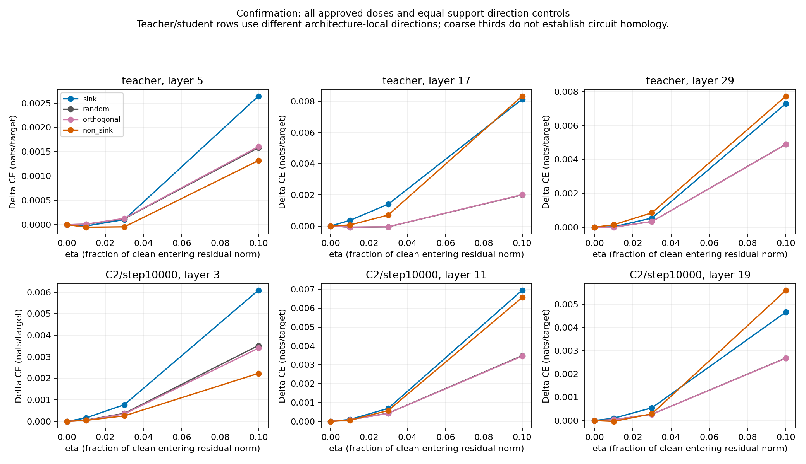

# KD-SINK E3 scientific results

Prepared on 2026-10-11 (Asia/Dhaka) by Codex. **E3 is complete: 32 independently audited state/panel bundles, 9,600 item records and 1,920 pooled operation rows.** This is a quantitative analysis of the completed scientific measurements, extending the earlier [completion receipt](../E3_NODIPC_COMPLETION.md). It adds no model inference.

The main result is that simultaneous sink deletion becomes more damaging as these students train, while responses to fixed relative-norm injections depend on layer, direction and dose. On confirmation, all-layer ΔCE rises from 0.014148 to 0.401207 for C2, from 0.015926 to 0.368216 for C3, and from 0.010674 to 0.249293 for C6 between updates 500 and 10,000. The teacher's all-layer effect is larger, 1.560854 nats/target. Equal-norm sink-direction responses do not produce one teacher-like ranking: other directions can be as damaging or more damaging. Clean isolated-layer rescue succeeds; a single clean donor generally leaves substantial damage when all other native layers remain edited.

These are descriptive seed-0 results. Two disjoint text panels and two physical execution GPUs do not supply independent training replications. Read the [combined E1–E3 interpretation](MECHANISTIC_E1_E3_RESULTS_20261011.md) alongside this report.

## Design, completion and execution provenance

Frozen GPT-2-large is the teacher (36 layers, 20 heads, width 1,280). The GPT-2-medium students (24 layers, 16 heads, width 1,024) are the exact S1 seed-0 C1/C2/C3/C5/C6 states at updates 500, 2,000 and 10,000, originally trained from configuration initialization. E3 includes all 15 students and the static teacher on both panels.

| Panel | Bundles | Reused Adrita bundles | Fresh Nodi bundles | Item records |
|---|---:|---:|---:|---:|
| Discovery | 16 | 16 | 0 | 4,800 |
| Confirmation | 16 | 1 (teacher) | 15 | 4,800 |
| Total | 32 | 17 | 15 | 9,600 |

Each bundle has 300 frozen 128-token blocks: **38,400 input tokens and 38,100 scored next-token targets**. The campaign reuses 600 unique blocks, not 9,600 unique texts. Discovery spans 46 source documents; confirmation 32. Strict corpus reconstruction, document-ID/text-hash disjointness, exact tokens/masks/order and checkpoint bytes were recovered during migration. Within-panel blocks can share documents. Confirmation came from the frozen LM2000 region with prior S1 clean endpoint measurements; it is a holdout for these new interventions, not historically unseen data.

All 60 operations per item are measured: three probes × (four directions × four doses + isolated deletion + isolated rescue + all-layer deletion + conditional rescue). The all-layer deletion is recorded once per probe context but is the same native-all-layer intervention; this report counts its effect once per state and never treats its three copies as independent measurements.

Adrita's RTX 4080 SUPER UUID is `GPU-2a5c25d0-1f73-919b-fd8b-f6f0df709aaf`; Nodi's is `GPU-72b4b307-b613-c35e-ea32-53f4431de9ee`. Both follow-up environments use Python 3.12.3, PyTorch 2.10.0+cu128, Transformers 5.3.0, FP32 eager, cache disabled and TF32 disabled. Source-training hardware/precision in S1 identities is separate from follow-up execution. The successor records real device/runtime and relocated paths; it does not spoof the old GPU. Scientific-field diff is empty, and original envelopes/results are preserved.

The prospectively fixed 12-item live migration comparator showed exact measured agreement. All 32 full-300 E2 dependencies also passed exact deletion-effect/factor/geometry comparisons, covering **39,062,998 numeric fields**. This supports the documented mixed-runtime analysis; it does not prove bitwise equality for every unrerun E3 tensor or an independent seed replication. Original and successor panel-file hashes differ because the relocated prepared artifact has new provenance; exact scientific item content/order is verified separately.

## Intervention definitions and denominators

Coarse probes are **student layers [3, 11, 19] and teacher layers [5, 17, 29]**, the approved lower-median representatives of native depth thirds. A probe edits one layer, not an entire third. Fine-layer selection and JVP analyses were not run. These coarse probes do not include the final student E2 peaks at layers 13 (C2), 12 (C3), or 15 (C6).

The injection grid is η = 0, .01, .03, .10. Requested per-query norm is `η × ||clean entering residual before ln_1||`; injection occurs at outgoing attention output before residual addition. The sink direction is the actual projected sink-deletion output delta. Controls are one deterministic Gaussian direction, its projection orthogonal to that sink direction, and projected non-sink value contrast `(v_key2 − v_key1) W_O`, with seed 20260927, keys [1,2], query_min 2 and floor 1e−8. The four directions use the same intersection of eligible supports. Equal relative norm within a state does not equate absolute norms, basis directions, model widths or functional dose across states.

Injection support is q=2–127 (126 positions/block before exclusions). Behavior scores q=0–126 (127 targets/block); q=127 has no within-block next-token target. Without exclusions, 125 scored positions/block are directly injected, with behavior still averaged over all 127 valid targets. Norm/support accounting therefore has 37,800 eligible positions per probe/bundle, not 38,100 prediction targets. Eta-zero outputs remain clean even where nonzero directions are undefined. Undefined support is reported, not assigned zero sensitivity.

ΔCE is edited-minus-clean loss in nats/target, self-KL is KL(clean || edited) over the full 50,257-token vocabulary, and flips are fractions of valid targets. Negative ΔCE means improved target loss. A three-probe mean averages **three separate interventions**; it is not their simultaneous effect or an architecture-independent circuit score. D / C means discovery / confirmation throughout.

## All-layer and equal-norm trajectories

| State | All-layer deletion ΔCE D / C | Sink η=.10: three-probe mean ΔCE D / C | Sink η=.10: three-probe mean self-KL D / C |
| --- | --- | --- | --- |
| teacher | 1.427109 / 1.560854 | 0.004771 / 0.006028 | 0.005289 / 0.005587 |
| C1/step500 | 0.007594 / 0.006532 | 0.000690 / 0.000917 | 0.002240 / 0.002225 |
| C1/step2000 | 0.014021 / 0.014295 | 0.005267 / 0.004700 | 0.004094 / 0.004088 |
| C1/step10000 | 0.051177 / 0.062280 | 0.005552 / 0.005892 | 0.004836 / 0.004978 |
| C2/step500 | 0.012265 / 0.014148 | -0.000394 / -0.001046 | 0.002104 / 0.002154 |
| C2/step2000 | 0.038174 / 0.038781 | 0.004139 / 0.004600 | 0.003156 / 0.003132 |
| C2/step10000 | 0.373226 / 0.401207 | 0.005466 / 0.005903 | 0.004832 / 0.005098 |
| C3/step500 | 0.012057 / 0.015926 | -0.000893 / -0.000607 | 0.002109 / 0.002197 |
| C3/step2000 | 0.044084 / 0.040333 | 0.004477 / 0.004190 | 0.004818 / 0.005024 |
| C3/step10000 | 0.346259 / 0.368216 | 0.005596 / 0.004657 | 0.004465 / 0.004615 |
| C5/step500 | 0.008026 / 0.005352 | 0.000775 / 0.000754 | 0.002070 / 0.002105 |
| C5/step2000 | 0.016026 / 0.017210 | 0.004565 / 0.004499 | 0.003943 / 0.003912 |
| C5/step10000 | 0.070046 / 0.085264 | 0.006752 / 0.006430 | 0.004905 / 0.004952 |
| C6/step500 | 0.011686 / 0.010674 | -0.000043 / -0.000175 | 0.001948 / 0.002021 |
| C6/step2000 | 0.029482 / 0.024998 | 0.002246 / 0.001712 | 0.002862 / 0.002774 |
| C6/step10000 | 0.227312 / 0.249293 | 0.005008 / 0.003817 | 0.003620 / 0.003696 |


All-layer damage increases at every observed interval in all five student conditions on both panels. C2/C3/C6 finish substantially above C1/C5, but all remain below the teacher's simultaneous effect. In contrast, sink-direction injection responses need not increase monotonically or follow the same ordering. C2's three-probe mean sink-direction ΔCE at η=.10 is -0.000394 / -0.001046 at update 500 and 0.005466 / 0.005903 at 10,000. A near-zero or negative signed mean is not absence of output sensitivity; self-KL and item heterogeneity remain visible.


*Teacher references are static; student lines connect measured checkpoints. E2 peaks are retrospective maxima. E3 injection averages are summaries of three separate coarse-layer edits.*

## Every coarse-layer control at update 10,000

The following table fixes η=.10 for a readable endpoint comparison and retains every prescribed direction and layer. Other doses, intermediate checkpoints, geometry and self-KL are in the full operation export.

| State | Layer | Sink ΔCE D / C | Random ΔCE D / C | Orthogonal ΔCE D / C | Non-sink ΔCE D / C |
| --- | --- | --- | --- | --- | --- |
| teacher | 5 | 0.002211 / 0.002643 | 0.001597 / 0.001583 | 0.001590 / 0.001603 | 0.002123 / 0.001317 |
| teacher | 17 | 0.007396 / 0.008143 | 0.002758 / 0.001999 | 0.002770 / 0.002013 | 0.008826 / 0.008346 |
| teacher | 29 | 0.004707 / 0.007300 | 0.004937 / 0.004895 | 0.004943 / 0.004885 | 0.007207 / 0.007733 |
| C1/step10000 | 3 | 0.003539 / 0.004421 | 0.002342 / 0.002575 | 0.002313 / 0.002560 | 0.002712 / 0.002983 |
| C1/step10000 | 11 | 0.007313 / 0.006050 | 0.002882 / 0.003445 | 0.002881 / 0.003424 | 0.006882 / 0.006210 |
| C1/step10000 | 19 | 0.005805 / 0.007205 | 0.002532 / 0.002619 | 0.002539 / 0.002612 | 0.009398 / 0.007458 |
| C2/step10000 | 3 | 0.007002 / 0.006092 | 0.002111 / 0.003525 | 0.002253 / 0.003400 | 0.002184 / 0.002230 |
| C2/step10000 | 11 | 0.007226 / 0.006953 | 0.001981 / 0.003484 | 0.001968 / 0.003459 | 0.008015 / 0.006567 |
| C2/step10000 | 19 | 0.002171 / 0.004664 | 0.002133 / 0.002689 | 0.002141 / 0.002680 | 0.007259 / 0.005601 |
| C3/step10000 | 3 | 0.007021 / 0.005677 | 0.002895 / 0.003057 | 0.002777 / 0.003031 | 0.002948 / 0.002304 |
| C3/step10000 | 11 | 0.003872 / 0.002909 | 0.002098 / 0.002830 | 0.002117 / 0.002826 | 0.007325 / 0.007508 |
| C3/step10000 | 19 | 0.005894 / 0.005385 | 0.002559 / 0.002753 | 0.002568 / 0.002735 | 0.006498 / 0.006107 |
| C5/step10000 | 3 | 0.004874 / 0.005147 | 0.002674 / 0.002714 | 0.002686 / 0.002723 | 0.001598 / 0.001881 |
| C5/step10000 | 11 | 0.007081 / 0.007054 | 0.003130 / 0.003472 | 0.003150 / 0.003444 | 0.006093 / 0.004938 |
| C5/step10000 | 19 | 0.008302 / 0.007090 | 0.002754 / 0.002336 | 0.002764 / 0.002345 | 0.007336 / 0.005907 |
| C6/step10000 | 3 | 0.005403 / 0.004573 | 0.002099 / 0.002866 | 0.002122 / 0.002822 | 0.003194 / 0.002346 |
| C6/step10000 | 11 | 0.003740 / 0.003057 | 0.002093 / 0.003119 | 0.002091 / 0.003119 | 0.008133 / 0.005672 |
| C6/step10000 | 19 | 0.005882 / 0.003821 | 0.002531 / 0.002864 | 0.002534 / 0.002852 | 0.007289 / 0.006539 |


At C3 layer 11 on confirmation, sink and random ΔCE are 0.002909 and 0.002830; non-sink is 0.007508. At C6 layer 11, sink is 0.003057 and random/orthogonal are about 0.003119. At teacher layer 29, random ΔCE is 0.004895 versus sink 0.007300, while non-sink is 0.007733. These are measured directional differences, not practical equivalence or significance tests. Sink direction is not universally the most damaging equal-norm direction.

### Full approved C2 endpoint dose curves

| C2/10000 layer | η | Sink ΔCE D / C | Random ΔCE D / C | Orthogonal ΔCE D / C | Non-sink ΔCE D / C |
| --- | --- | --- | --- | --- | --- |
| 3 | 0 | 0.000000 / 0.000000 | 0.000000 / 0.000000 | 0.000000 / 0.000000 | 0.000000 / 0.000000 |
| 3 | 0.01 | 0.000256 / 0.000165 | -0.000072 / 0.000061 | -0.000057 / 0.000053 | 0.000045 / 0.000048 |
| 3 | 0.03 | 0.001052 / 0.000777 | -0.000032 / 0.000374 | 0.000012 / 0.000347 | 0.000248 / 0.000258 |
| 3 | 0.1 | 0.007002 / 0.006092 | 0.002111 / 0.003525 | 0.002253 / 0.003400 | 0.002184 / 0.002230 |
| 11 | 0 | 0.000000 / 0.000000 | 0.000000 / 0.000000 | 0.000000 / 0.000000 | 0.000000 / 0.000000 |
| 11 | 0.01 | 0.000140 / 0.000102 | -0.000060 / 0.000087 | -0.000060 / 0.000084 | 0.000179 / 0.000060 |
| 11 | 0.03 | 0.000804 / 0.000688 | -0.000010 / 0.000433 | -0.000012 / 0.000426 | 0.000949 / 0.000574 |
| 11 | 0.1 | 0.007226 / 0.006953 | 0.001981 / 0.003484 | 0.001968 / 0.003459 | 0.008015 / 0.006567 |
| 19 | 0 | 0.000000 / 0.000000 | 0.000000 / 0.000000 | 0.000000 / 0.000000 | 0.000000 / 0.000000 |
| 19 | 0.01 | -0.000118 / 0.000100 | -0.000012 / 0.000039 | -0.000012 / 0.000038 | 0.000126 / -0.000036 |
| 19 | 0.03 | -0.000129 / 0.000547 | 0.000113 / 0.000270 | 0.000115 / 0.000268 | 0.000776 / 0.000290 |
| 19 | 0.1 | 0.002171 / 0.004664 | 0.002133 / 0.002689 | 0.002141 / 0.002680 | 0.007259 / 0.005601 |


The plots below show all approved doses and directions for the teacher and the registered C2 endpoint on confirmation; numerical discovery counterparts remain in the table/CSV. Small η responses can be negative and curves need not be linear. No slope extrapolation, fitted onset, or response-based dose selection is introduced.



## Clean-output rescue and conditional restoration

Isolated deletion plus the clean donor attention output restores clean outputs. The largest absolute pooled isolated-rescue ΔCE is **0**; the largest eta-zero absolute pooled ΔCE is **0**. Their original live logit checks also passed. Zero scalar loss change alone is not the complete tensor-level proof; the qualified runner supplies that proof.

`All-layer + one donor` restores the clean attention output at the chosen probe while every other native layer remains sink-deleted. `Conditional loss reduction` is all-layer ΔCE minus this conditional ΔCE. It is a signed difference in nats/target, can be negative, and is neither a mediated fraction nor an additive contribution.

| State | Layer | Isolated deletion ΔCE D / C | All-layer + one donor ΔCE D / C | Conditional loss reduction D / C |
| --- | --- | --- | --- | --- |
| teacher | 5 | 0.003059 / 0.002793 | 1.414208 / 1.543233 | 0.012900 / 0.017621 |
| teacher | 17 | 0.020130 / 0.022215 | 1.107288 / 1.203843 | 0.319820 / 0.357011 |
| teacher | 29 | 0.005553 / 0.010060 | 1.318983 / 1.452097 | 0.108126 / 0.108757 |
| C1/step10000 | 3 | 0.000292 / 0.000111 | 0.050507 / 0.061677 | 0.000671 / 0.000603 |
| C1/step10000 | 11 | 0.001117 / 0.000893 | 0.048112 / 0.059598 | 0.003065 / 0.002682 |
| C1/step10000 | 19 | 0.000332 / 0.000544 | 0.046452 / 0.055485 | 0.004726 / 0.006795 |
| C2/step10000 | 3 | 0.002747 / 0.001466 | 0.364118 / 0.391851 | 0.009108 / 0.009357 |
| C2/step10000 | 11 | 0.004758 / 0.004306 | 0.364981 / 0.390159 | 0.008245 / 0.011049 |
| C2/step10000 | 19 | 0.001659 / 0.004240 | 0.333739 / 0.358520 | 0.039487 / 0.042687 |
| C3/step10000 | 3 | 0.001506 / 0.000411 | 0.339020 / 0.361337 | 0.007239 / 0.006879 |
| C3/step10000 | 11 | 0.002004 / 0.001390 | 0.333564 / 0.357310 | 0.012695 / 0.010906 |
| C3/step10000 | 19 | 0.002567 / 0.002804 | 0.326115 / 0.348081 | 0.020143 / 0.020135 |
| C5/step10000 | 3 | 0.000573 / 0.000043 | 0.068302 / 0.083488 | 0.001744 / 0.001776 |
| C5/step10000 | 11 | 0.001015 / 0.001098 | 0.061225 / 0.076510 | 0.008822 / 0.008754 |
| C5/step10000 | 19 | 0.000690 / 0.000640 | 0.061687 / 0.074193 | 0.008359 / 0.011071 |
| C6/step10000 | 3 | 0.000557 / 0.000216 | 0.222183 / 0.243913 | 0.005129 / 0.005379 |
| C6/step10000 | 11 | 0.002153 / 0.001540 | 0.217591 / 0.242180 | 0.009721 / 0.007113 |
| C6/step10000 | 19 | 0.002698 / 0.001755 | 0.208591 / 0.231880 | 0.018722 / 0.017413 |


For C2 on confirmation, restoring layer 19 reduces all-layer ΔCE by 0.042687, but leaves 0.358520 rather than returning to clean. Restoring layer 11 reduces it by 0.011049 and leaves 0.390159. For the teacher, restoring layer 17 reduces damage by 0.357011 and still leaves 1.203843. The same layer's isolated deletion and its restoration in an already edited network answer different conditional questions. Smaller rescue effects do not establish that a layer is unnecessary, and larger ones do not establish unique mediation.

## Ordered telescopes and nonlinear dependence

Every bundle retains complete ascending and descending native-layer orders. The sum of ordered increments equals the all-layer endpoint within the original numerical gates. Individual increments depend on the preceding edited layers and may be negative. The table below uses only the predefined coarse probes, with complete native-layer accounts in `e3_telescopes.csv`.

| State | Layer | Forward increment D / C | Reverse increment D / C |
| --- | --- | --- | --- |
| teacher | 5 | 0.013386 / 0.012348 | 0.016927 / 0.009862 |
| teacher | 17 | 0.080402 / 0.091732 | 0.147442 / 0.151684 |
| teacher | 29 | 0.045232 / 0.044595 | 0.016704 / 0.022718 |
| C2/step10000 | 3 | 0.004318 / 0.004278 | 0.009792 / 0.009060 |
| C2/step10000 | 11 | 0.006729 / 0.006638 | 0.010695 / 0.013998 |
| C2/step10000 | 19 | 0.013890 / 0.013214 | 0.003425 / 0.006583 |


The common endpoint is invariant to the final ordering; the increment assigned to a layer is not. For C2/10,000 confirmation, layer 11 contributes 0.006638 in forward order and 0.013998 in reverse order. These are order-specific accounts, not independent circuit contributions. FP32 behavior ΔCE and the telescope's recorded CE account can differ at small numerical scale; their declared closure checks remain unchanged.

## Item distributions and the registered temporal contrast

All-layer deletion distributions retain signed effects on the same 300 items per state/panel. Quartiles and p90 describe heterogeneous items; they are not confidence intervals or independent-document uncertainty.

| Panel | State / all-layer deletion | Mean ΔCE | Median | Q25 | Q75 | P90 |
| --- | --- | --- | --- | --- | --- | --- |
| discovery | teacher | 1.427109 | 1.371591 | 1.123495 | 1.623494 | 2.010644 |
| discovery | C1/step10000 | 0.051177 | 0.044244 | 0.021658 | 0.071013 | 0.098742 |
| discovery | C2/step10000 | 0.373226 | 0.352875 | 0.267124 | 0.459778 | 0.582320 |
| discovery | C3/step10000 | 0.346259 | 0.328343 | 0.243628 | 0.412874 | 0.540712 |
| discovery | C5/step10000 | 0.070046 | 0.058290 | 0.033004 | 0.091413 | 0.131985 |
| discovery | C6/step10000 | 0.227312 | 0.205582 | 0.155090 | 0.271826 | 0.362700 |
| confirmation | teacher | 1.560854 | 1.374439 | 1.135324 | 1.701896 | 2.372292 |
| confirmation | C1/step10000 | 0.062280 | 0.048172 | 0.023429 | 0.082509 | 0.130744 |
| confirmation | C2/step10000 | 0.401207 | 0.370157 | 0.302025 | 0.478044 | 0.629024 |
| confirmation | C3/step10000 | 0.368216 | 0.346775 | 0.256841 | 0.452974 | 0.577539 |
| confirmation | C5/step10000 | 0.085264 | 0.064046 | 0.034594 | 0.109309 | 0.186119 |
| confirmation | C6/step10000 | 0.249293 | 0.225037 | 0.161863 | 0.303988 | 0.433320 |


C2's prespecified temporal comparison pairs each update-500 item with the identical update-10,000 item. Its all-layer contrast appears once; normalized sink-direction contrasts are shown for all three fixed probes at η=.10.

| Panel | C2 operation: 10,000 minus 500 | Mean | Median | Q25 | Q75 | P90 |
| --- | --- | --- | --- | --- | --- | --- |
| discovery | all_delete/layer3 | 0.360962 | 0.336510 | 0.252616 | 0.438715 | 0.561283 |
| discovery | injection/sink/layer3/eta0.1 | 0.002715 | 0.002668 | -0.005898 | 0.012282 | 0.018624 |
| discovery | injection/sink/layer11/eta0.1 | 0.009063 | 0.009073 | -0.000010 | 0.018958 | 0.027158 |
| discovery | injection/sink/layer19/eta0.1 | 0.005804 | 0.005840 | -0.000702 | 0.012140 | 0.020619 |
| confirmation | all_delete/layer3 | 0.387059 | 0.356010 | 0.271303 | 0.471566 | 0.617764 |
| confirmation | injection/sink/layer3/eta0.1 | 0.003345 | 0.002652 | -0.004687 | 0.011760 | 0.020696 |
| confirmation | injection/sink/layer11/eta0.1 | 0.008966 | 0.008281 | -0.001916 | 0.018151 | 0.027503 |
| confirmation | injection/sink/layer19/eta0.1 | 0.008536 | 0.008772 | 0.000981 | 0.014865 | 0.022957 |


These changes mix the evolving network's response with its evolving checkpoint-local directions/reference norms. They do not isolate a single invariant vector through training.

## Exact support and numerical integrity

The table sums query-layer observations across the three probes at η=.10. It includes q=127 and is deliberately separate from prediction-target counts. Counts for every layer/dose and direction-specific exclusions remain in `e3_injection_support.csv`.

| State | Common / eligible: discovery ; confirmation | Excluded D / C |
| --- | --- | --- |
| teacher | 113,400 / 113,400 ; 113,400 / 113,400 | 0 / 0 |
| C1/step500 | 111,149 / 113,400 ; 111,459 / 113,400 | 2251 / 1941 |
| C1/step2000 | 111,002 / 113,400 ; 112,197 / 113,400 | 2398 / 1203 |
| C1/step10000 | 113,400 / 113,400 ; 113,400 / 113,400 | 0 / 0 |
| C2/step500 | 113,400 / 113,400 ; 113,400 / 113,400 | 0 / 0 |
| C2/step2000 | 113,400 / 113,400 ; 113,400 / 113,400 | 0 / 0 |
| C2/step10000 | 113,400 / 113,400 ; 113,400 / 113,400 | 0 / 0 |
| C3/step500 | 113,400 / 113,400 ; 113,400 / 113,400 | 0 / 0 |
| C3/step2000 | 113,400 / 113,400 ; 113,400 / 113,400 | 0 / 0 |
| C3/step10000 | 113,400 / 113,400 ; 113,400 / 113,400 | 0 / 0 |
| C5/step500 | 113,400 / 113,400 ; 113,400 / 113,400 | 0 / 0 |
| C5/step2000 | 113,400 / 113,400 ; 113,400 / 113,400 | 0 / 0 |
| C5/step10000 | 113,400 / 113,400 ; 113,400 / 113,400 | 0 / 0 |
| C6/step500 | 113,400 / 113,400 ; 113,400 / 113,400 | 0 / 0 |
| C6/step2000 | 113,394 / 113,400 ; 113,396 / 113,400 | 6 / 4 |
| C6/step10000 | 113,400 / 113,400 ; 113,400 / 113,400 | 0 / 0 |


Exclusions at η=.10 total **7,803 query-layer observations**: early C1 and update-2,000 C6 have incomplete common support; all other state/panel rows have full support. Controls share the same intersection within each item, but support need not be identical across checkpoints. These exclusions constrain cross-state comparisons and are not zero-effect observations.

Full raw reporting verification rehashed **9,600 item files**, recomputed **1,920 operation pools** and checked 21,120 pooled scalars. Maximum absolute raw-to-summary discrepancy was `0` across those heterogeneous scalar units; comparison also checks the original units and denominators. All four control records share exactly matching support metadata in every item/layer/dose. No unavailable item-operation was silently dropped: count **0**. This does not imply that every direction had every eligible query available.

| Original audit diagnostic | Maximum recorded absolute error |
|---|---:|
| E2 componentwise output/logit parity | 9.1552734375e-05 |
| Delivered injection norm | 1.0037740736379419e-06 |
| Double full-vocabulary loss geometry | 4.5241588253475129e-15 |

Original acceptance gates remain parity abs 1e−3 + rel 1e−4 × |reference|, norm abs 1e−6 + rel 1e−6 × requested norm, and double geometry abs 1e−10 with zero relative slack. These are numerical correctness checks, not scientific equivalence margins. Historical norm-audit failures and corrected population bookkeeping are preserved in the migration record. Per-query clean residual tensors were not serialized, so their historical reconstruction remains unavailable; original live norm checks, audited scalar support accounting and fresh fixed-item qualification are the disclosed evidence. No threshold was relaxed to obtain a desired scientific outcome.

| Identity | SHA-256 / commit |
| --- | --- |
| Original scientific executor | `f96c73061f9ef288c72f309e09c4c1f17a8a6701` |
| Original E3 | `5673eaefc30ff238ee338b0cff973032f6f2579e985592f0c837a04c6f24cf33` |
| Nodi E3 successor | `36e202754ae7c2bca152f50f40ffe56bc520dc1a4ad05f4579721b307f56e03e` |
| Original Adrita runtime | `df8b0b3258a9e9bd236e8a9d7281e95a68d3e5555733e76404fda338db5ada0b` |
| Nodi runtime | `73c86bd2bd42383ef7648db5132d5dc1f644782440ec520cc0ced55ef1deb295` |
| Final 32-bundle independent audit | `e62d8eca7031843ff2afe56a75b1620630428d535e142221cb7382f2a1b4e0ab` |


The immutable archive and imported Adrita attempts remain external. New results live in `C:/KD-E3-Nodi-20261010/campaign_nodipc`; final provenance is in `final_completion/ALL_PHASE_PORTABLE_JOIN.json`. This report reuses existing runner/full independent semantic audits, freshly checks every E3 raw item byte, repools scalar metrics and verifies support/telescope metadata. It does not repeat model inference or reconstruct unsaved activation tensors.

## Interpretation limits and reproducible exports

E3 separates direction-specific downstream response from natural deletion magnitude and from the E1 parameter routes. Equal residual-normalized injections do not supply matched absolute activation dose across architectures. One fixed Gaussian control is a direction control, not a random-direction ensemble. Coarse probes cannot resolve unsampled sensitive layers; all-layer deletion changes many layers together. Rescue and telescopes demonstrate conditional/nonlinear behavior without identifying a unique causal mediator. No across-seed reproducibility, p-values, confidence intervals, equivalence decisions, composite inheritance score or unmeasured later-training convergence is claimed.

All 1,920 unrounded [operation rows](mechanistic_e1_e3_results_20261011/e3_operations.csv), [support counts](mechanistic_e1_e3_results_20261011/e3_injection_support.csv), [state endpoints](mechanistic_e1_e3_results_20261011/e3_state_endpoints.csv), [rescues](mechanistic_e1_e3_results_20261011/e3_rescues.csv), [ordered telescopes](mechanistic_e1_e3_results_20261011/e3_telescopes.csv), [item distributions](mechanistic_e1_e3_results_20261011/e3_item_distributions.csv), and [all C2 temporal contrasts](mechanistic_e1_e3_results_20261011/e3_C2_paired_temporal.csv) are included. [Analysis/provenance](mechanistic_e1_e3_results_20261011/analysis.json) and [file hashes](mechanistic_e1_e3_results_20261011/FILES_SHA256.json) bind the compact exports; raw item/target records, datasets, weights and bulk logs remain outside Git. SVG versions of both figures are included for export.

The [fresh reporting verification receipt](mechanistic_e1_e3_verification_20261011.json) records source/report/code hashes, exact commands, 19 passing CPU tests and verification scope.

```powershell
.venv/Scripts/python.exe scripts/summarize_mechanistic_e1_e3.py --root C:/KD-E3-Nodi-20261010 --output reports/mechanistic_e1_e3_results_20261011
.venv/Scripts/python.exe scripts/render_mechanistic_e1_e3_reports.py --data-directory reports/mechanistic_e1_e3_results_20261011
```

Read the [execution contract](../design/e6a_v2/MECHANISTIC_E1_E3_EXECUTION.md), [E3 specification](../design/e6a_v2/studies/MECHANISTIC_E3_PROTOCOL_v1.md), original approved envelope and versioned Nodi successor with their later approval records. Historical draft-status prose does not replace those actual approved identities.
